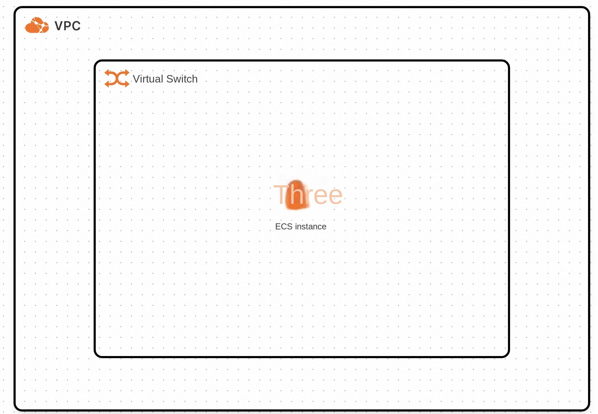
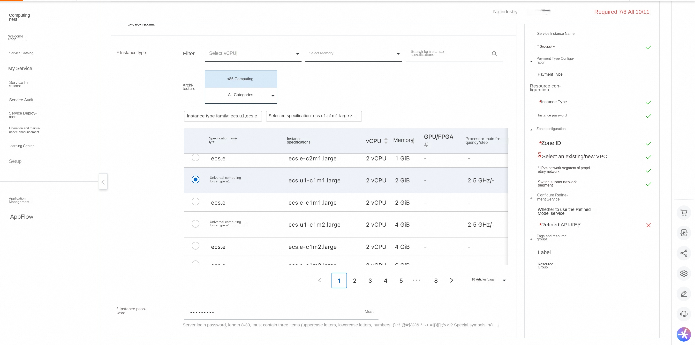
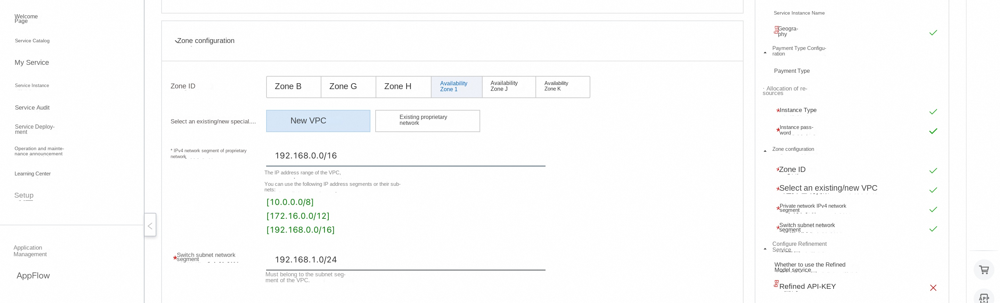
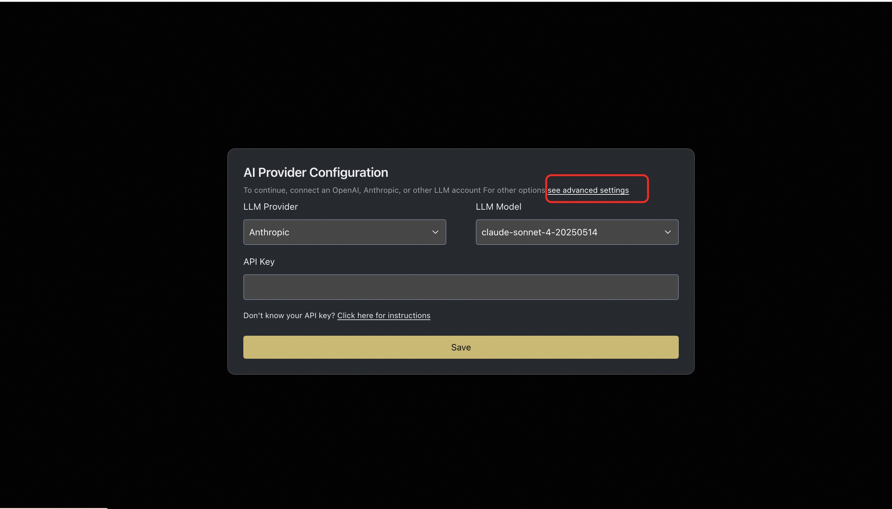
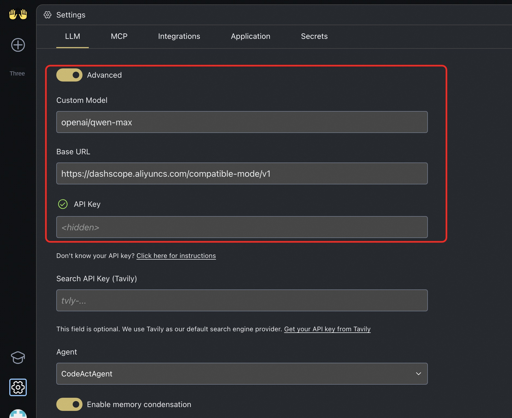

# OpenHands Service Instance Deployment Document

## Overview
OpenHands is an AI-based programming tool designed to improve development efficiency and reduce developer coding through multi-agent collaboration. It supports code writing, command-line operations, web browsing and other functions to help developers quickly complete project construction, testing and deployment. OpenHands provides a secure sandbox environment to ensure the security of code execution. At the same time, it also supports multi-agent collaboration, which can decompose complex tasks into multiple sub-tasks, which are completed by different agents. The OpenHands covers 15 benchmarks in software engineering, web browsing and other fields, providing strong support for research and application in academia and industry.
**Core features include**
-Code generation and iteration
-Generate code from scratch
-Enhance existing code functionality
-Support for multiple programming languages
-Smart code optimization
-Seamless integration capability
-Perfect integration into existing projects
-Add new function module
-Configure automated workflows
-Reduce duplication of work
-Bug fixes and refactoring
-Intelligent diagnosis of problems
-Automatic test case generation
-Code modular optimization
-Improved code readability

## Billing Description

OpenHands expenses on computing nests relate primarily:

-Selected vCPU and memory specifications
-System disk type and capacity
-public network bandwidth

Billing methods include:

-Pay-As-You-Go (hours)
-Package year and package month

## Deployment Architecture
The deployment architecture adopts ECS (cloud server) stand-alone deployment
'(Deployment overview)'

## Deployment process

### Deployment steps
1. Visit the Computing Nest OpenHands Community Edition [Deployment Link](https://computenest.console.aliyun.com/service/instance/create/default?type=user&ServiceName=OpenHands社区版)
Enter the deployment parameters as prompted, and configure the ECS instance type and password.

2. Configure the VPC and zone

### Validation Results

1. View the service instance. After the service instance is created successfully, the deployment time takes about 2 minutes. After the deployment is complete, the corresponding service instance is displayed on the page.
2. Access the OpenHands through the service instance. After entering the corresponding service instance, you can obtain the access address on the page.

### Instructions for use
#### Configure the model using Refined
1. After entering the OpenHands page, you first need to configure the model. If you use the recommend model, you can configure the corresponding API Key.
2. If you want to use a refined model, you can click "Advanced Settings"

3. In the Advanced Settings, the base Url configured by the compatible interface of OpenAI is https://dashscope.aliyuncs.com/compatible-mode/v1
Select Custom Model, the format of Custom Model is "openai/model_name" optional model_name [reference link](https://help.aliyun.com/zh/model-studio/compatibility-of-openai-with-dashscope?spm=a2c4g.11186623.help-menu-2400256.d_2_9_0.fef0516eQvFk8s&scm=20140722.H_2833609. OR_help-T_cn ~ zh-V_1)

4. Configure the refined API Key and click "Save" to save it. For how to obtain API Key, please refer to: [Obtaining Bailian API Key](https://developer.aliyun.com/article/1655158?spm = 5176.24779694.0.0.178 f7f8bkOyGLR)
