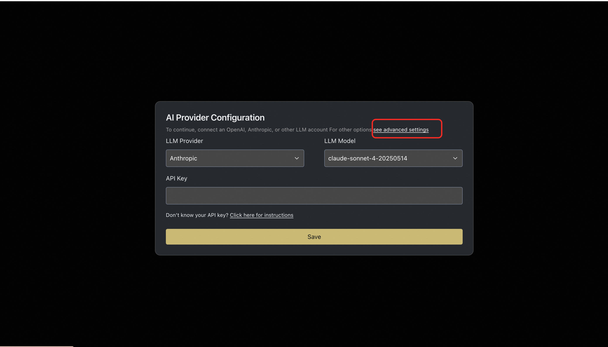
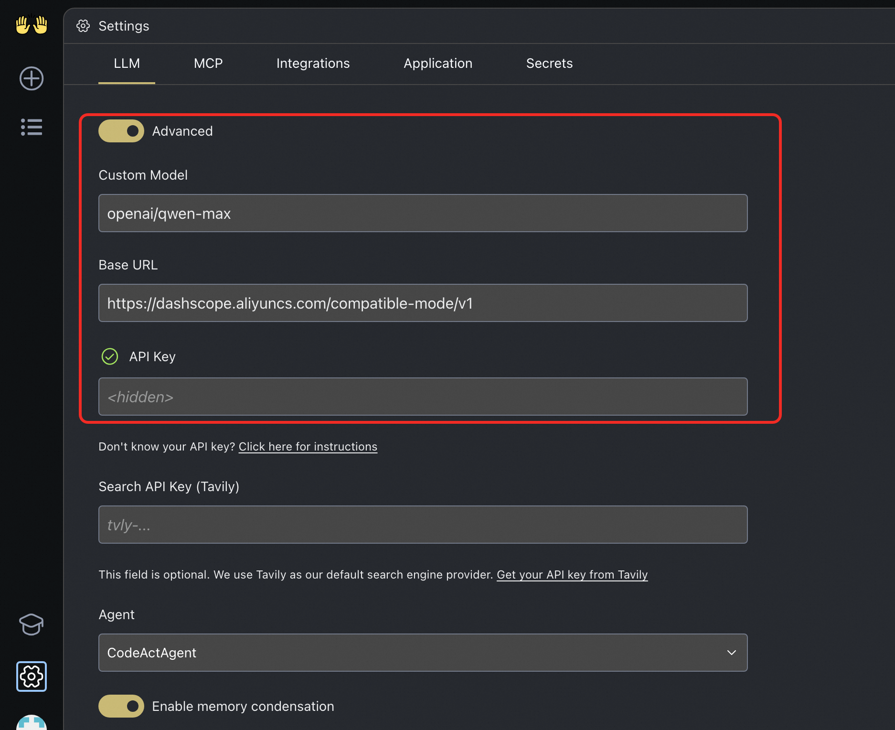

# OpenHands服务实例部署文档

## 概述
OpenHands 是一款基于 AI 的编程工具，旨在通过多智能体协作提升开发效率，减少开发者的编码工作量。它支持代码编写、命令行操作、网页浏览等多种功能，帮助开发者快速完成项目构建、测试和部署。OpenHands 提供了一个安全的沙箱环境，确保代码执行的安全性。同时，它还支持多代理协作，能够将复杂任务分解为多个子任务，由不同的代理协同完成。OpenHands 涵盖了软件工程、网页浏览等多个领域的 15 个基准测试，为学术界和工业界的研究与应用提供了有力支持。
**核心特性包括**
- 代码生成与迭代
  - 从零开始生成代码 
  - 增强现有代码功能 
  - 支持多种编程语言
  - 智能代码优化
- 无缝集成能力 
  - 完美融入已有项目 
  - 添加新功能模块
  - 配置自动化工作流
  - 减少重复工作
- Bug修复与重构 
  - 智能诊断问题
  - 自动生成测试用例
  - 代码模块化优化
  - 提高代码可读性

## 计费说明

OpenHands在计算巢上的费用主要涉及：

- 所选vCPU与内存规格
- 系统盘类型及容量
- 公网带宽

计费方式包括：

- 按量付费（小时）
- 包年包月

## 部署架构
部署架构采用ECS(云服务器)单机部署
`(部署概述内容)`

## 部署流程

### 部署步骤
1. 访问计算巢OpenHands社区版[部署链接](https://computenest.console.aliyun.com/service/instance/create/default?type=user&ServiceName=OpenHands%E7%A4%BE%E5%8C%BA%E7%89%88)
   按提示填写部署参数,配置ECS实例规格和密码
   
2. 配置专有网络和可用区
   

### 验证结果

1. 查看服务实例。服务实例创建成功后，部署时间大约需要2分钟。部署完成后，页面上可以看到对应的服务实例。
2. 通过服务实例访问OpenHands。进入到对应的服务实例后，可以在页面上获取到访问地址

### 使用说明
#### 配置使用百炼的模型
1. 进入OpenHands页面后，首先需要配置模型，如果使用推荐的模型，配置对应API Key即可。
2. 如果想使用百炼的模型，可以点击"Advanced Settings"
   
3. Advanced Settings中通过OpenAI的兼容接口来配置百炼的Base Url 为：https://dashscope.aliyuncs.com/compatible-mode/v1
选择Custom Model， Custom Model的格式为"openai/model_name" 可选的model_name[参考链接](https://help.aliyun.com/zh/model-studio/compatibility-of-openai-with-dashscope?spm=a2c4g.11186623.help-menu-2400256.d_2_9_0.fef0516eQvFk8s&scm=20140722.H_2833609._.OR_help-T_cn~zh-V_1)
   
4. 配置百炼的API Key，点击"Save"保存即可
